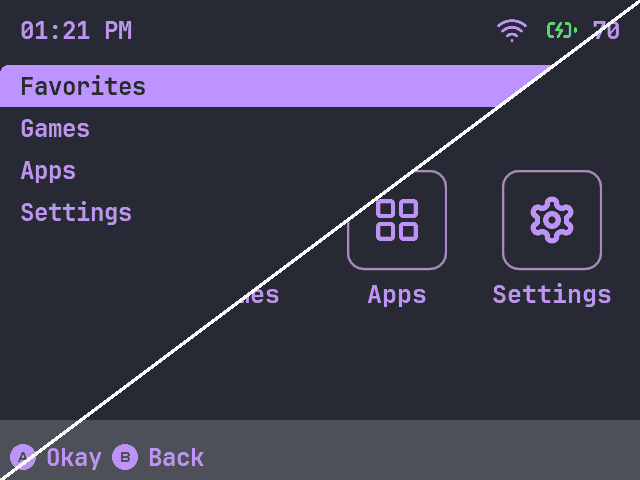
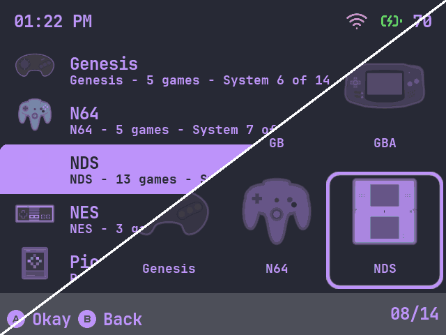

<picture>
  <source media="(prefers-color-scheme: dark)" srcset=".github/banner_dark.webp">
  <source media="(prefers-color-scheme: light)" srcset=".github/banner_light.webp">
  
</picture>

  

    <b>Aesthetic Spruce</b> is an unofficial fork of <a href="https://github.com/joneavila/aesthetic"><b>Aesthetic</b></a> by Jonathan Avila, being reworked into a <a href="https://github.com/spruceUI/spruceOS">spruceOS</a> app that generates themes directly on your handheld.
  

> [!IMPORTANT]
> **This repository is not affiliated with, endorsed by, or maintained by the original author, and it is not an official spruceUI project.**
> It is a community project whose only relationship to the original is that it started from its source code (MIT licensed), as a fork of `joneavila/aesthetic` at v1.10.1; the git history carries the original commits. "Spruce" in the name says which firmware it targets, nothing more.
> Do not report problems with *this* fork to the original author, and do not report problems with the original muOS app here.
>
> The original app is **Aesthetic for muOS** by **Jonathan Avila** ([@joneavila](https://github.com/joneavila)): https://github.com/joneavila/aesthetic

## ❤️ Support the original author

All of the design, the UI, the colour tooling and the theme pipeline this fork builds on were created by Jonathan Avila. If this project is useful to you, please support **them**, not this fork:

- Donate via the original author's Ko-fi: 
- Star and use the original app: https://github.com/joneavila/aesthetic ([Releases](https://github.com/joneavila/aesthetic/releases), [wiki](https://github.com/joneavila/aesthetic/wiki), [muOS community thread](https://community.muos.dev/t/aesthetic-create-themes-directly-on-your-handheld))

This fork accepts no donations.

## 🌲 Aesthetic Spruce

Pick colours, a gradient, a font and a layout on the handheld; the app writes a complete PyUI theme to `Themes/<name>` and activates it.

  <table>
    <tr>
      <td align="center" width="50%">
         
        <b>Main menu</b>
      </td>
      <td align="center" width="50%">
         
        <b>System menu</b>
      </td>
    </tr>
  </table>
  
Eight built-in presets on a MagicX Zero 28, each split diagonally: the <b>list</b> layout above the line, the <b>grid</b> layout below. System icons use the <i>SPRUCE Mono</i> style. These are screenshots of the handheld, not mock-ups.

## 📦 Installation

> [!IMPORTANT]
> Built for **spruceOS 4.3.x, 4.4.x and 4.5.x** on aarch64 devices. The Miyoo A30 and Mini family are not supported — see [docs/DEVICES.md](docs/DEVICES.md) for the full list.

1. Download `AestheticSpruce_vX.Y.Z_sd-overlay.zip` from [Releases](https://github.com/CatalyticArkun/aesthetic-spruce/releases). Nightlies are marked pre-release.
2. Unzip it onto the root of the spruceOS card, so that `App/AestheticSpruce` sits next to your other apps.
3. Launch ***Apps*** > ***Aesthetic Spruce***.

## ⚙️ Usage

1. From the main menu, pick the options to customise. Each screen shows its controls at the bottom; A confirms, B goes back, Start opens Settings.
2. Select **Build Theme** to write the theme to `Themes/<name>`.
3. Choose **Activate Now** to switch to it, or apply it later via ***Settings*** > ***Theme***.
4. Save and load presets from ***Settings*** (Start) > ***Save Theme Preset*** / ***Load Theme Preset***.

## ✨ What you can change

- **Colours** — background and foreground from a palette, an HSV picker or a hex code; solid or two-colour gradient; separate charging and low-battery colours.
- **Font** — *Inter*, *Montserrat*, *Nunito*, *JetBrains Mono*, *Cascadia Code*, *Retro Pixel* or *Bitter*.
- **Layout** — grid of tiles or a text list; box art width; title, clock, battery and button hints each shown or hidden.
- **System icons** — off, a glyph per family, the system's first letter, or SPRUCE's own art redrawn in the theme's colours (*SPRUCE Art*, two tones) or in one (*SPRUCE Mono*).
- **spruceOS options** — view type for the game list, systems and apps; Recents, Collections and Favorites tiles; index counter; screensaver timeout.
- **33 presets** — nine originals, ten RetroArch menu themes, twelve classic-system palettes and *MinUI* in black and white. Save your own alongside them.

Themes are written with your device's native resolution set plus the 640x480 base set, so they also work if you move the card to another handheld.

## 📚 Documentation

- [docs/DEVICES.md](docs/DEVICES.md) — which devices and spruceOS versions are supported, and device-specific notes.
- [docs/DEVELOPMENT.md](docs/DEVELOPMENT.md) — building, how the theme model and renderers work, adding an option, testing on a device.
- [docs/CREDITS.md](docs/CREDITS.md) — the original project, fonts, icons and libraries.
- [docs/UPSTREAM-CHANGES.md](docs/UPSTREAM-CHANGES.md) — what differs from the muOS original, and the AI disclosure.
- [docs/TODO.md](docs/TODO.md) — open items.

**Problems?** Open an issue on [this repository](https://github.com/CatalyticArkun/aesthetic-spruce). For the muOS app, use the [original repository](https://github.com/joneavila/aesthetic).

## ⭐ Credits

**Aesthetic** — the original application, design and source — is by **[Jonathan Avila (@joneavila)](https://github.com/joneavila)**, [MIT](LICENSE), [Ko-fi](https://ko-fi.com/F1F51COHHT). Fonts, icons and libraries are credited in full in [docs/CREDITS.md](docs/CREDITS.md).

## ⚖️ License

This project is licensed under the MIT License. The original copyright notice, `Copyright (c) 2025 Jonathan Avila`, is preserved in [LICENSE](LICENSE) and must stay with any copy or substantial portion of this software. Changes made in this fork are released under the same license.
